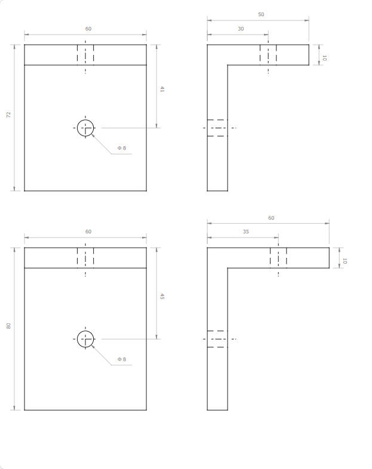

# JS SVG CAD 简单说明文档

## Point 对象方法

### clone 方法

```javascript
clone((x = 0), (y = 0));
```

- **描述**: 克隆当前点，并可选择性地偏移。
- **参数**:
  - `x`: 可选，x 轴偏移量，默认为 0。
  - `y`: 可选，y 轴偏移量，默认为 0。
- **返回**: 返回一个新的`Point`对象，位置为原点偏移后的位置。

### offset 方法

```javascript
offset(x, y);
```

- **描述**: 对当前点进行偏移。
- **参数**:
  - `x`: x 轴偏移量。
  - `y`: y 轴偏移量。
- **返回**: 返回当前`Point`对象，位置为偏移后的位置。

### move 方法

```javascript
move(v, d);
```

- **描述**: 沿着单位向量`v`移动距离`d`。
- **参数**:
  - `v`: 方向的单位向量。
  - `d`: 移动的距离。
- **返回**: 返回当前`Point`对象，位置为移动后的位置。

### add 方法

```javascript
add(p);
```

- **描述**: 将另一个点的坐标加到当前点上。
- **参数**:
  - `p`: 另一个`Point`对象。
- **返回**: 返回当前`Point`对象，位置为两点之和。

### subtract 方法

```javascript
subtract(p);
```

- **描述**: 从当前点中减去另一个点的坐标。
- **参数**:
  - `p`: 另一个`Point`对象。
- **返回**: 返回当前`Point`对象，位置为两点之差。

### multi 方法

```javascript
multi(n);
```

- **描述**: 将当前点的坐标乘以一个因子。
- **参数**:
  - `n`: 乘以的因子。
- **返回**: 返回当前`Point`对象，位置为原坐标乘以因子后的位置。

### to 方法

```javascript
to(x, y);
```

- **描述**: 创建一条从当前点到新坐标的线段。
- **参数**:
  - `x`: 目标点的 x 坐标。
  - `y`: 目标点的 y 坐标。
- **返回**: 返回一条新的`Line`对象。

### arc 方法

```javascript
arc(x, y, r);
```

- **描述**: 创建一个以当前点为起点的圆弧。
- **参数**:
  - `x`: 圆弧终点的 x 坐标。
  - `y`: 圆弧终点的 y 坐标。
  - `r`: 圆弧半径。
- **返回**: 返回一个新的`Arc`对象。

### circle 方法

```javascript
circle(r);
```

- **描述**: 创建以当前点为圆心的圆。
- **参数**:
  - `r`: 圆的半径。
- **返回**: 返回一个新的`Circle`对象。

### show 方法

```javascript
show(r);
```

- **描述**: 在当前点位置显示一个小圆，用于标记点。
- **参数**:
  - `r`: 标记圆的半径。
- **返回**: 返回当前`Point`对象。

### as 方法

```javascript
as(id);
```

- **描述**: 将当前点注册为全局变量。
- **参数**:
  - `id`: 全局变量的名称。
- **返回**: 返回当前`Point`对象。

`Point`对象提供了一系列方法来创建和操作点，这些方法非常有用于 CAD 绘图和图形操作中。通过`Point`对象，用户可以轻松地创建线条、圆弧、圆等图形元素，并进行复杂的几何操作。

### Line 函数

```javascript
function Line(p1, p2)
```

- **描述**: 创建一条线段。
- **参数**:
  - `p1`: 第一个点对象，定义线段的起点。
  - `p2`: 第二个点对象，定义线段的终点。
- **返回**: 返回一个 SVG 线段对象。

### Arc 函数

```javascript
function Arc(p1, p2, r)
```

- **描述**: 创建一个圆弧。
- **参数**:
  - `p1`: 圆弧的起始点对象。
  - `p2`: 圆弧的终止点对象。
  - `r`: 圆弧的半径。
- **返回**: 返回一个 SVG 圆弧对象。

### Circle 函数

```javascript
function Circle(p1, r)
```

- **描述**: 创建一个圆。
- **参数**:
  - `p1`: 圆心的点对象。
  - `r`: 圆的半径。
- **返回**: 返回一个 SVG 圆对象。

### Mirror 函数

```javascript
function Mirror(shapes, p1, p2)
```

- **描述**: 对一组图形进行镜像处理。
- **参数**:
  - `shapes`: 图形对象数组。
  - `p1`: 镜像线的一个端点。
  - `p2`: 镜像线的另一个端点。
- **返回**: 无返回值，对传入的图形对象进行镜像处理。

### Rotate 函数

```javascript
function Rotate(shapes, p1, angle)
```

- **描述**: 对一组图形进行旋转。
- **参数**:
  - `shapes`: 图形对象数组。
  - `p1`: 旋转的中心点。
  - `angle`: 旋转角度（以度为单位）。
- **返回**: 无返回值，对传入的图形对象进行旋转处理。

### Mark 函数

```javascript
function Mark(p1, p2, content)
```

- **描述**: 在 p1 点标记内容。
- **参数**:
  - `p1`: 标记箭头的起始点。
  - `p2`: 标记箭头的终止点。
  - `content`: 要标记的内容。
- **返回**: 无返回值，创建标记。

### Dim 函数

```javascript
function Dim(ps1, d, ps2)
```

- **描述**: 绘制尺寸标注。
- **参数**:
  - `ps1`: 第一组点对象，用于确定标注的位置。
  - `d`: 标注线的偏移量。
  - `ps2`: 第二组点对象，用于确定标注的方向。
- **返回**: 无返回值，绘制尺寸标注。

### Text 函数

```javascript
function Text(p1, content)
```

- **描述**: 在指定位置创建文本。
- **参数**:
  - `p1`: 文本的位置点对象。
  - `content`: 要显示的文本内容。
- **返回**: 返回一个 SVG 文本对象。

---

## Sample


